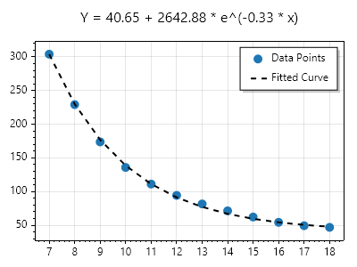

# SwarmFit

**SwarmFit is a .NET package for fitting curves to X/Y data** points using [particle swarm optimization](https://en.wikipedia.org/wiki/Particle_swarm_optimization). Unlike other gradient decent strategies, finding the derivative of the error function is not required. This allows SwarmFit to fit curves for equations with an arbitrary number of unknown variables.

