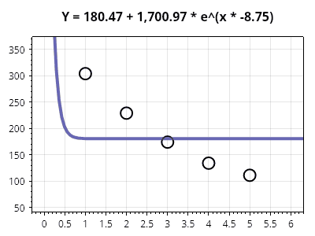
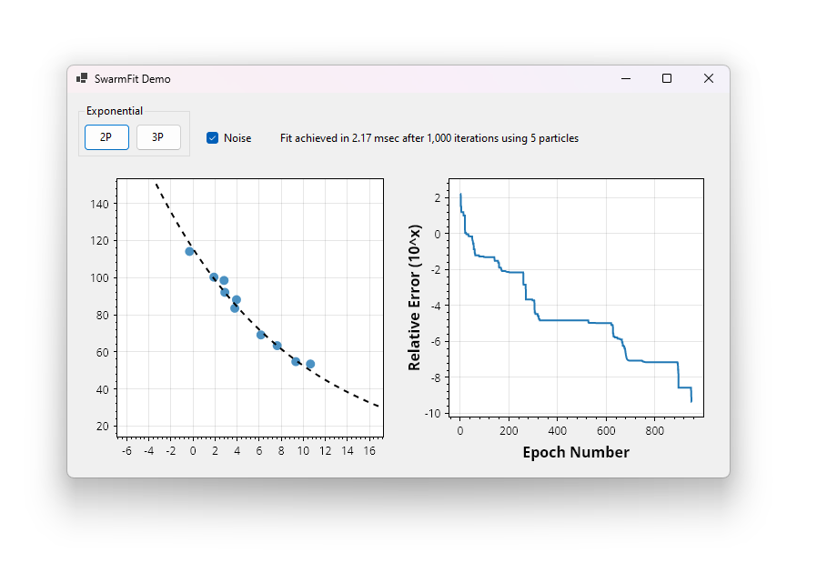

# SwarmFit

[](https://github.com/swharden/SwarmFit/actions/workflows/ci.yaml)

**SwarmFit is a .NET package for fitting curves to X/Y data** points using [particle swarm optimization](https://en.wikipedia.org/wiki/Particle_swarm_optimization). Unlike other gradient decent strategies, finding the derivative of the error function is not required. SwarmFit can be used to calculate best fit curves for arbitrary equations that use any number of variables.



## Quickstart

```cs
// data points to fit
double[] xs = [1, 2, 3, 4, 5];
double[] ys = [304, 229, 174, 134, 111];

// define a fit function using any number of variables.
static double MyFunc(double x, double[] vars)
{
    // Y = A + B * e^(x*C)
    return vars[0] + vars[1] * Math.Exp(x * vars[2]);
}

// define the minimum and maximum value for each variable
double[] minVars = [-100, -5000, -10];
double[] maxVars = [100, 5000, 10];

// perform the fit
double[] solution = QuickFit.Solve(xs, ys, MyFunc, minVars, maxVars);

// display the solution
double a = solution[0];
double b = solution[1];
double c = solution[2];
Console.WriteLine($"Y = {a} + {b} * e^(x * {c})");
```

## Graphical Demo

A sample application is included with this repository which generates random data and fits it using common curve functions. This application demonstrates advanced features such as fitter fine-tuning, iterative error logging, charting, etc.

